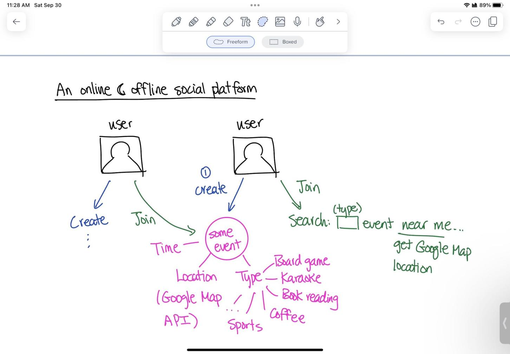

# SocialSquad
CSC207 Project

**Project domain**

An interactive social media that allows people to create events and gather offline.

**Brief description**
- Registered users can start real-time small gathering events open for other users to join.
- Registered users can also search up and join offline events that are nearby.
- See diagram:
  

**Links to API documentation**
- Bing Maps

  https://learn.microsoft.com/en-us/bingmaps/

**Screenshot of trying the API**

**List of potential technical difficulties**
1. Update the map in real time.

When a user starts an event, the event location will be added to the application's map, other users will see this event 
instantly on their Map view. We want to enforce this feature by automatically update information shown by the API as 
soon as an event is created. We don't know if it is possible at this point.

2. Events "pinned" on the map move as user moves the map on their view

When looking for an event to join, users not only can use the Search feature, but also casually look around on their Map
View. The Map View (rendered by the API) should show any events happening within the View as pins. When the user move 
their View, the map pins should also change. Some may disappear as their location is out of the current View, some may 
appear as their location is now inside the View, some may move within the View.